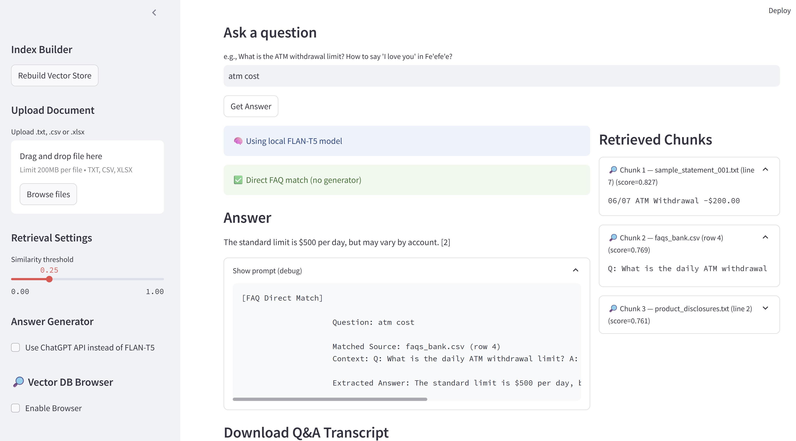

# Banking & Fe'efe'e Assistant — RAG Demo (Portfolio)

This project is a compact, demonstrable Retrieval-Augmented Generation (RAG) system I built to showcase practical skills with NLP, embeddings, vector search, and LLM-driven answer synthesis. It's designed to be friendly: clear architecture, polished UX (Streamlit), and easy to run locally or deploy to the Cloud.

Why this project is portfolio-worthy
- Real-world scenario: customer-facing Q&A over banking FAQs, product disclosures, and uploaded bank statements.
- Full RAG stack: document ingestion, chunking, SentenceTransformer embeddings, FAISS vector search, and LLM-based answer generation with grounding citations.
- Reproducible: runnable locally and tuned for Streamlit Cloud deployment.
- Thoughtful UX: transcript download, retrieval browser, configurable similarity threshold, and optional ChatGPT polishing.



Live demo (local or cloud)
- Run locally with CPU-only models or deploy to Streamlit Cloud for quick sharing with anyone, as a prototype.

Key features
- Ingest text/csv/xlsx and automatically chunk documents for retrieval.
- FAISS vector store backed by SentenceTransformers embeddings (`all-MiniLM-L6-v2` by default).
- Local generation with `google/flan-t5-base` (no external API keys required) and optional ChatGPT polishing.
- Phrasebook-aware shortcuts: direct answers for Q/A and bilingual phrasebook entries (Fe'efe'e / English / French).
- Streamlit UI with controls for similarity threshold, reranker, and transcript download.

Custom documents & any domain
- You can customize the app to search over your own documents anytime. Drop new .txt/.csv/.xlsx files in the `data/docs/` folder or use the "Upload Document" area in the app sidebar.
- After adding or removing documents, rebuild (recompute embeddings / retrain) the vector store by running:
```powershell
python src/ingest.py --data_dir data/docs --vs_dir vectorstore
```
or click the **Rebuild Vector Store** button in the sidebar of the running app.
- Once the vector store is rebuilt the app will search over your new content. This means the system works for any domain (legal, product manuals, HR, phrasebooks, etc.) — as long as you update the corpus and rebuild the index, the retrieval and generation will use your context.


Quickstart
1) Create & activate a Python environment
```powershell
python -m venv .venv
.venv\Scripts\activate
```

2) Install dependencies (Streamlit Cloud-ready)
```powershell
pip install -r requirements.txt
```

3) Build the vector store (one-time step or after uploads)
```powershell
python src/ingest.py --data_dir data/docs --vs_dir vectorstore
```

4) Run the app
```powershell
streamlit run src/app_streamlit.py
```

Open the URL printed by Streamlit (typically http://localhost:8501) and try example prompts.

Example prompts to try
- "What are overdraft fees and how can I avoid them?"
- "Summarize recurring charges in the uploaded statement for May."
- "How do I say 'I love you' in Fe'efe'e?"

Repository layout
```
.  # root
├─ README.md
├─ requirements.txt
├─ data/docs/                # source documents for ingestion
├─ vectorstore/              # index (created by ingest.py)
└─ src/
   ├─ app_streamlit.py       # Streamlit interface
   ├─ ingest.py              # corpus builder + index creation
   ├─ rag_pipeline.py        # retrieval + answer generation
   └─ config.py
```

Notes for reviewers
- This demo is intentionally self-contained and modest in compute requirements. Replace the local generator with a production LLM (OpenAI, Bedrock, etc.) and add auth/guardrails for production-readiness.
- For deployment to Streamlit Cloud, see the pinned `requirements.txt` (below).


Contact / attribution
- Repo owner: Shck Tchamna

---
